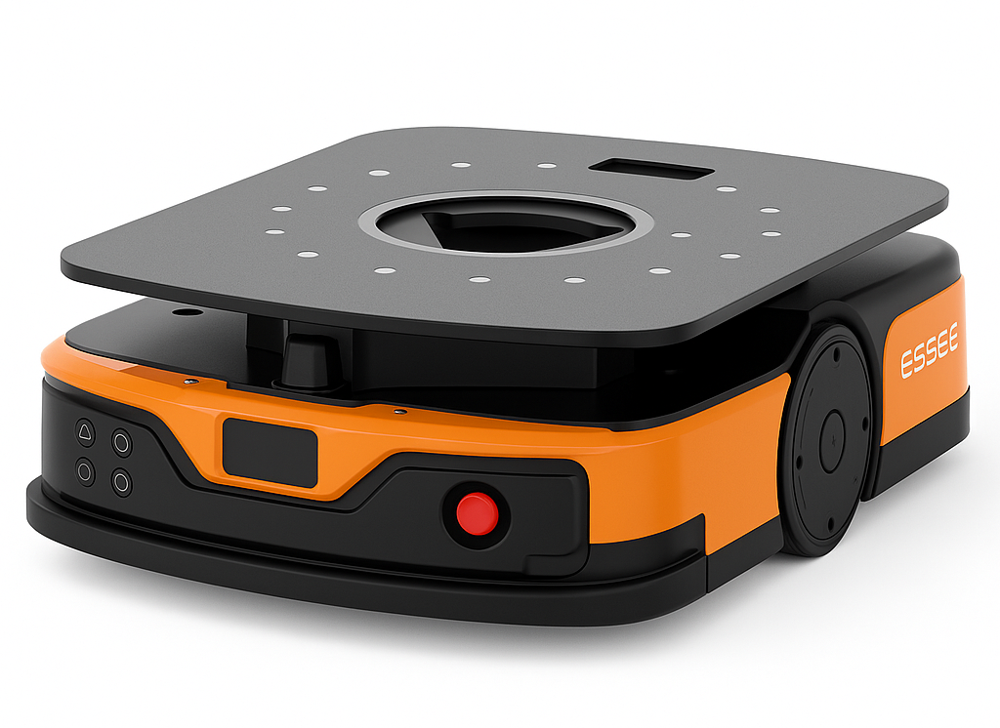
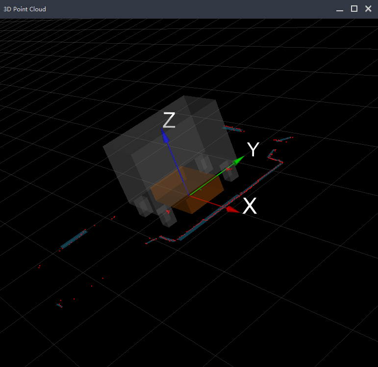
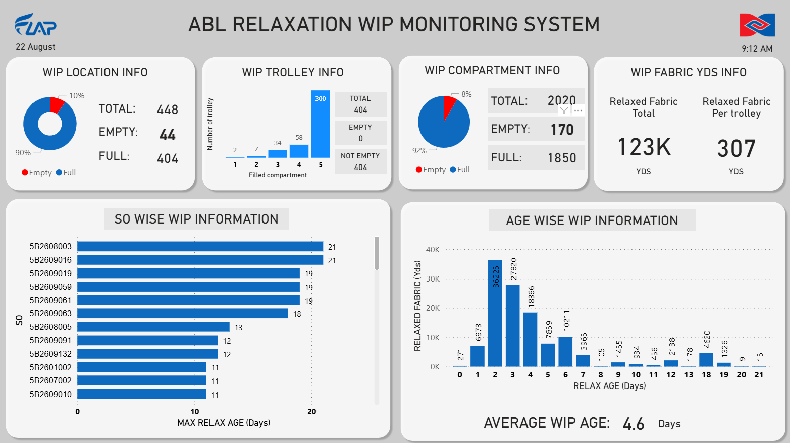
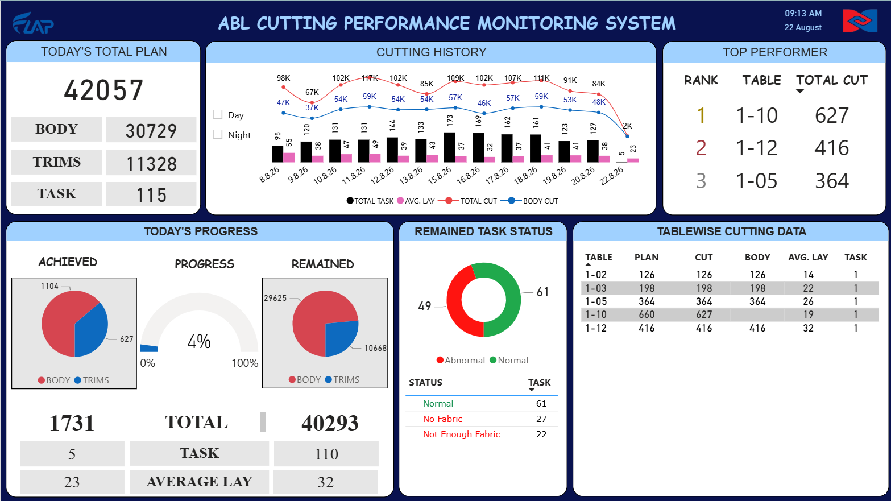
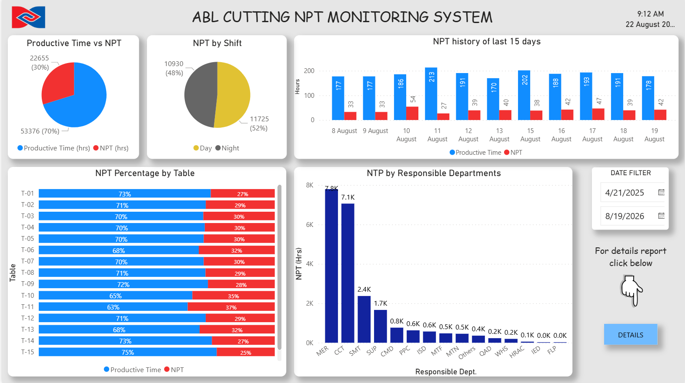
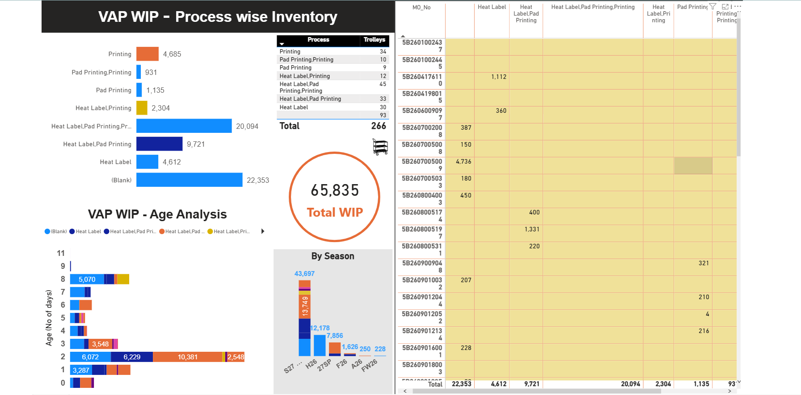
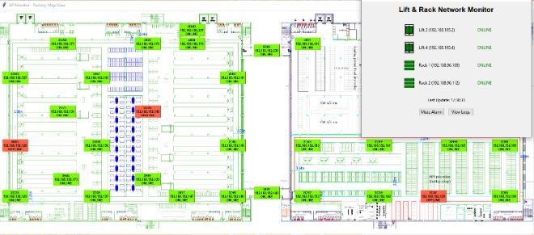

#  FLAP–Autonomous Mobile Robot Driven Cyber-Physical Smart Manufacturing System in RMG Industry

**Crystal International Group Ltd. | Amigo Bangladesh Ltd.**  
*Industry 4.0 Implementation in Ready-Made Garments (RMG) Manufacturing*

<p align="center">
  
  
  
  
  
</p>

---

## 📋 Overview

The **FLAP Project** (Finishing Center, Logistic Center, Assembly Center, Parts Center) is a flagship **Industry 4.0 initiative** by **Crystal International Group Ltd.**, one of the world’s leading **Ready-Made Garments (RMG)** manufacturers.  
It integrates **robotics**, **industrial automation**, and **digital manufacturing systems** into a unified, intelligent production ecosystem.

After successful implementation in China, FLAP demonstrated:

- 🚀 **40% higher production efficiency**
- ⚙️ Reduced manual labor and human error
- 🔄 Seamless process-to-process information and material flow
- 📈 Enhanced data visibility and traceability

**Amigo Bangladesh Ltd.**, a subsidiary of Crystal Group, is the first facility in Bangladesh to implement this system, representing a major leap toward **smart manufacturing transformation** in the textile industry.

<p align="center">
  
</p>

---

## 👨‍🔧 Author & Role

**Itmam Rubayet Annan**  
*Senior Robotics & Automation Engineer*  
Crystal International Group Ltd.  

**Responsibilities:**

- Developed intelligent **AGV/AMR systems** for automated material transport using **AI-driven navigation** and **dynamic path planning**.
- Prepared and optimized RCS maps and configured transportation workflows.
- Integrated **robotic arms, elevators, and conveyors** with AGVs for complete material-handling automation.  
- Established **MES–RCS communication** for synchronized process execution.  
- Designed and deployed **PLC/HMI-based subsystems** integrated into the central control framework.  
- Led **cross-functional coordination**, user training, and on-site deployment.  
- Managed **budget and performance optimization** for robotic and automation rollouts.

---

## 🛠️ Technologies & Tools

- Hikrobot AGV
- RCS, MES, WCS
- PLC, Industrial Controller
- PostgreSQL for Database
- Python for Automation Scripting
- AutoCAD for Layout
- Power BI for Monitoring Dashboard
- RFID Reader, IO Controller, IoT Device

<p align="center">
  
</p>
---


## 🏗️ System Architecture

                ┌──────────────┐
                │  WMS / MES   │
                └──────┬───────┘
                       │
              ┌────────┴────────┐
              ▼                 ▼
          ┌───────┐         ┌───────┐
          │  RCS  │         │  WCS  │
          └───────┘         └───────┘
              |                 |
              ▼                 ▼
        ┌───────────┐    ┌──────────────┐
        |   AGV     |    │     PLC      │
        └───────────┘    └──────┬───────┘
                                │
                                ▼
              ┌─────────────────────────────────────────┐
              │   Elevator/ Conveyor/ IoT Controller    │
              └─────────────────────────────────────────┘
                      

---

## 🏗️ System Architecture

<p align="center">
  
</p>

### 🔹 Multilayer Control Architecture

The FLAP architecture follows a **hierarchical control model**, ensuring seamless data and command flow between enterprise-level decision systems and field-level robotic equipment.

```
Enterprise Layer
 ├── CICS (Crystal Integrated Cutting System)
 ├── MES (Manufacturing Execution System)
 ├── WMS (Warehouse Management System)
 └── RCS (Robotic Control System)
 
Field Layer
 ├── AGV / AMR Robots (Navigation, local control)
 ├── Robotic Arms (Pick/place, loading)
 ├── PLC/HMI Systems (Local machine control)
 └── Vision Systems (Inspection / QC)

Physical Infrastructure
 ├── Charging Stations
 ├── Conveyors & Elevators
 └── Workstations (Cutting, Spreading, Relaxation, Inspection)
```

**Reference Figures:**
<p align="center">
  
</p>

---

## ⚙️ Process Flow Breakdown

### 🟫 Overall Process Flow
Overall flow of process how material and informations transferred processwise. 

- 1️⃣ Relaxation – AGV brings trolley to workstation → after unrolling, it returns to WIP
- 2️⃣ Spreading – Trolley automatically positions behind the table → moves after the lay is completed
- 3️⃣ Panel Loading – Post-cutting, stickered/non-stickered cakes go directly to CPI WIP by AGV
- 4️⃣ Central CPI – If defects → sent to Recut WIP, else → directly to Supermarket
- 5️⃣ Central Recut – After recut, moves to Value Added Process (Heat Seal, Pad Print, Embroidery, Print)
- 6️⃣ Supermarket – From VAP → supermarket → ready for sewing input

<p align="center">
    
</p>

### 🟨 Relaxation
Automated relaxation process ensuring consistent fabric handling before cutting.  
<p align="center">
    
    
</p>


### 🟩 Cutting & Spreading
Automated fabric spreading and cutting managed by the CICS system.  
<p align="center">
  
    
</p>


### 🟥 Inspection Zone
Fbric Inspection process has been automated by AGV transportation and User interface based working procedure 
<p align="center">
  
    
</p>


### 🟦 Panel Replacement
Fbric Inspection process has been automated by AGV transportation and User interface based working procedure 
<p align="center">
  
    
</p>


### 🟧 Subcon and Value Added Process
Fbric Inspection process has been automated by AGV transportation and User interface based working procedure 
<p align="center">
  
    
</p>


### 🟪 Panel Supermarket
Fbric Inspection process has been automated by AGV transportation and User interface based working procedure 
<p align="center">
  
    
</p>


## ⚙️ Autonomous Mobile Robots

### 🟦 AGV (Automated Guided Vehicle) System Configurtion
AGV System configuration by RCS (Robotic Control System) and Fleet Management
<p align="center">
  
</p>
<p align="center">
    
</p>
<p align="center">
  
    
</p>

### 🟧 AGV Operation
Autonomous robots perform inter-process material transport and staging.  
<p align="center">
  
    
</p>

### 🟧 Standard Mapping
Autonomous robots perform inter-process material transport and staging.  
<p align="center">
  
  </p>
<p align="center">
    
</p>
---

## 🔗 System Integration Summary

| Layer | System | Function |
|-------|---------|----------|
| **Enterprise** | CICS | Centralized data and command management |
| **Control** | RCS | AGV task execution and path planning |
| **Execution** | MES | Scheduling and production tracking |
| **Field** | HIKRobot Platform | Hardware integration and sensor data |
| **Human Interface** | Operation Center | Real-time analytics and supervision |

All systems communicate through **TCP/IP** and **OPC-UA**, enabling full interoperability between digital control and robotic execution layers.

---

## 🤖 Robotics and Automation Components

| Component | Description |
|------------|-------------|
| **AGV / AMR Robots** | Autonomous mobile platforms for fabric and WIP transport |
| **RCS (Robotic Control System)** | Multi-robot coordination and navigation control |
| **PLC / HMI Systems** | Local automation for conveyors and mechanical stations |
| **Vision Systems** | AI-based fabric inspection and quality detection |
| **HIKRobot Framework** | Provides vision tracking, sensor data, and localization |
| **CICS Dashboard** | Unified monitoring and analytics across all subsystems |

---

## 📊 Production Process Monitoring Dashboard

**Fabric Relaxation Status Dashboard**

Designed a Fabric Relaxation WIP Monitoring Dashboard to ensure proper fabric relaxation compliance before cutting by PowerBI. The dashboard tracks real-time WIP status across locations, trolleys, and compartments, including full and empty conditions. It provides age-wise and SO-wise fabric relaxation analysis, total relaxed fabric yardage, and average WIP age. 

What it monitors:

- WIP location, trolley, and compartment status
- Full vs empty WIP distribution
- Total relaxed fabric yards and per-trolley load
- Age-wise relaxation status (days)
- SO-wise maximum relaxation age
- Average WIP age tracking

<p align="center">
  
</p>

**Cutting Performance Monitoring Dashboard**

Developed a comprehensive Cutting Performance Monitoring Dashboard to track real-time cutting operations across tables and shifts. The dashboard provides table-wise performance comparison, top performer ranking, average lay analysis, and abnormal task detection. 

 What it monitors:
 
- Daily cutting plan vs actual achievement
- Body and trims cutting progress
- Table-wise cutting performance and ranking
- Cutting historical trends (day/night shifts)
- Abnormal task alerts (e.g., fabric shortage, no marker)
- Average lay and task distribution

<p align="center">
    
</p>

**Non Productive Time (NPT) Monitoring Dashboard**

Built a Cutting NPT Monitoring Dashboard to analyze productivity loss and downtime causes across cutting operations. The dashboard compares productive time versus NPT, analyzes NPT by shift, table, department, and date range, and tracks historical trends over time. It highlights high-loss areas and responsible departments, supporting root cause analysis and continuous improvement initiatives aimed at reducing non-productive time.
 
 What it monitors:
 
- Productive time vs non-productive time (hours)
- Shift-wise NPT comparison (day vs night)
- Table-wise NPT percentage
- Department-wise NPT contribution
- NPT trends over recent days
- Date-based filtering for detailed analysis

<p align="center">
  
</p>

– Tracks inventory quantity across different VAP processes.
– Provides an overall view of WIP quantity currently in the VAP section.
– Monitors the number of trolleys and WIP distribution by process.
– Identifies how long materials have been waiting at each process.
– Monitors WIP distribution across different seasons/orders.
– Provides detailed WIP quantity tracking by manufacturing order (MO).
– Helps identify processes with high WIP accumulation and aging materials.

<p align="center">
    
</p>

**Access Point Network Monitoring System**

Developed a Python-based remote network monitoring system to continuously monitor Access Points (APs) and network racks in real time. The system performs automated health checks, detects connectivity issues, and triggers alerts when abnormalities are identified. It provides live status visualization, event logging, and alarm notifications, enabling faster troubleshooting and reduced network downtime. 

🔹 Technologies Used
- Python
- Network protocols (ICMP / TCP-IP)
- GUI & background threading

<p align="center">
    
</p>

---


## 📊 Project Outcomes

✅ **40% increase in production throughput**  
✅ **End-to-end digital traceability** of materials  
✅ **Zero manual intervention** in logistics between processes  
✅ **First full FLAP deployment in Bangladesh**  
✅ **Modular design** for scalable Industry 4.0 integration  

---

## 🔬 Research & Innovation Insights

This project demonstrates a **real-world Industry 4.0 architecture** with strong research implications in:

- Multi-robot task allocation and optimization  
- Cyber-physical MES–RCS–AGV integration  
- Vision-based inspection and quality control  
- Intelligent scheduling and dynamic path planning  


---

## 📸 Project Gallery

---


## 🧪 Testing & Commissioning

---


## 🚀 Future Improvements

- 🤖 AI-powered camera system for automated quality inspection and defect detection.
- 🦾 Robotic arm for automated fabric placement.
- ♻️ Smart garbage-management system for collecting released panels during panel replacement.

---


## ⚠️ Disclaimer

This repository contains a sanitized representation of a professional industrial automation project.
Proprietary company information, production data, network configurations and confidential materials have been excluded.

---

<p align="center">
  © 2026 Itmam Rubayet Annan — All Rights Reserved  
</p>


